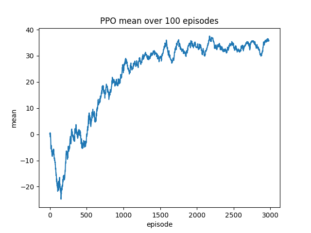
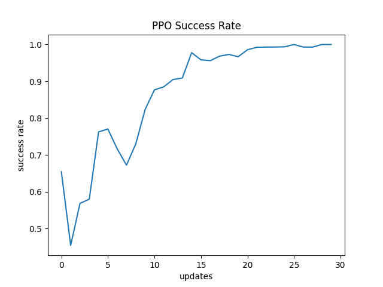
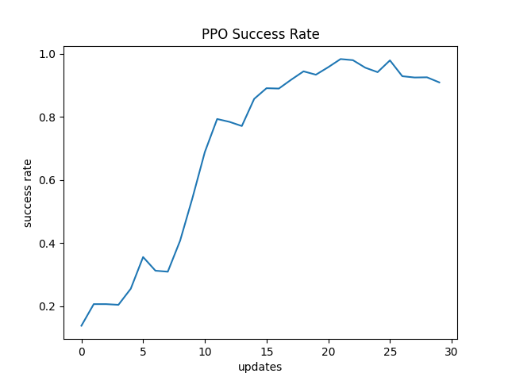

# PPO for Dynamic Obstacle Grid World

This project implements a **Proximal Policy Optimization (PPO)** agent trained to navigate a **grid world environment** containing **dynamic obstacles**. The objective of the agent is to move from a randomly initialized start position to a randomly placed goal while avoiding collisions with moving obstacles of varying shapes.

Two versions of the environment are provided:

1. **DynamicObstacleShapes** – Three-channel observation space where obstacles, the agent, and the goal are represented separately.  
2. **DynamicObstacleShapesSingleChannel** – Single-channel observation space where obstacles, the agent, and the goal are represented in a combined and normalized form.

---

<video width="480" controls>
  <source src="videos/MovingObstacles-episode-0.mp4" type="video/mp4">
</video>

## Features

- **Dynamic Obstacles**: Obstacles move at every timestep, increasing complexity and making path planning more challenging.  
- **Obstacle Shapes**: Obstacles have varying shapes such as L-shapes, lines, and squares.  
- **Dense and Sparse Reward Options**:  
  - *Sparse Reward*: Only reaching the goal yields a positive reward.  
  - *Dense Reward*: Additional shaping reward for moving closer to the goal.  
- **Visualization Support**: Rendering implemented using Matplotlib for debugging and monitoring.  
- **PPO Implementation**: Compatible with `gymnasium`.

---

## Environment Details

### Observation Space
| Environment | Shape | Description |
|-------------|-------|-------------|
| `DynamicObstacleShapes` | `(3, nrow, ncol)` | Three separate channels: obstacles, agent, goal. |
| `DynamicObstacleShapes_1_channel` | `(1, nrow, ncol)` | Single normalized channel containing all entities. |

**Channel encoding:**

| Object    | 3-Channel Value | 1-Channel Value |
|-----------|-----------------|-----------------|
| Obstacles | 1.0 (channel 0) | 100 / 255 ≈ 0.39 |
| Agent     | 1.0 (channel 1) | 255 / 255 = 1.0 |
| Goal      | 1.0 (channel 2) | 200 / 255 ≈ 0.78 |

---

### Action Space
The agent has four discrete movement actions:

| Action | Description |
|--------|-------------|
| 0 | Move Up |
| 1 | Move Down |
| 2 | Move Left |
| 3 | Move Right |

Invalid actions (attempts to move outside the grid) result in a small penalty.

---

### Reward Function
| Event | Reward |
|-------|--------|
| Step penalty | -0.01 |
| Invalid move penalty | -0.1 |
| Collision with obstacle | -5.0 |
| Reaching the goal | +50.0 |
| Dense reward (optional) | +0.2 × (change in distance to goal) |

The dense reward provides intermediate feedback to the agent, improving learning efficiency by rewarding progress toward the goal.

---

### Episode Termination
Episodes end under any of the following conditions:
1. The agent reaches the goal.
2. The maximum step count (`max_steps`) is reached(500 steps for each episode).

---

## Environment Parameters

| Parameter | Default Value | Description |
|------------|---------------|-------------|
| `nrow` | 10 | Number of grid rows |
| `ncol` | 10 | Number of grid columns |
| `max_step` | 500 | Maximum steps per episode |
| `num_obstacles` | 3 | Number of moving obstacles |
| `dense_reward` | False | Enable dense reward shaping.


## Custom PPO Implementation

This project includes a **custom implementation of Proximal Policy Optimization (PPO)**, written entirely from scratch.

The implementation is designed to handle environments with **dynamic obstacles** and supports **dense** or **sparse reward signals**, and **1-channel** or **3-channel** input grid.

---

### Key Features

This PPO implementation includes several advanced techniques designed to improve **training stability**, **sample efficiency**, and **safe policy updates**.  
Each feature is described in detail below, with corresponding code snippets from the implementation.

---

#### 1. Generalized Advantage Estimation (GAE)

GAE reduces the **variance** of the policy gradient while keeping the **bias** low.  
Instead of relying only on discounted returns, GAE computes a **smoothed advantage estimate** that balances bias and variance using the parameter λ (lambda).  
This makes training **more stable and efficient**.
In particular:

- Produces smoother advantage estimates.
- Helps the agent **learn faster** in environments with **sparse or noisy rewards**.


**Formula:**

$$
A_t = \delta_t + (\gamma \lambda) \delta_{t+1} + (\gamma \lambda)^2 \delta_{t+2} + ...
$$

Where:
- $(\delta_t = r_t + \gamma V(s_{t+1}) - V(s_t))$ is the temporal difference (TD) error.

**Code Snippet:**
```python
def compute_gae(self, rewards, values, dones, next_state):
    with torch.no_grad():
        advantages = torch.zeros((len(rewards)))
        gae = 0
        for t in reversed(range(len(rewards))):
            if t == len(rewards)-1:
                next_value = self.policy.get_value(next_state).detach()
            else:
                next_value = values[t+1]

            mask = 1 - dones[t]
            delta = rewards[t] + self.gamma * mask * next_value - values[t]
            gae = delta + self.gamma * self.lam * mask * gae
            advantages[t] = gae
    return advantages
```

---

#### 2. Clipped Surrogate Objective

The core idea of PPO is to **limit policy updates**, preventing the agent from making large, destructive changes to its behavior.  
This is achieved by clipping the probability ratio between the new and old policies.

**Formula:**

$$
L^{CLIP}(\theta) = \mathbb{E}_t \big[ \min(r_t(\theta) A_t, \, \text{clip}(r_t(\theta), 1-\epsilon, 1+\epsilon) A_t) \big]
$$

Where:
- $(r_t(\theta) = \frac{\pi_\theta(a_t|s_t)}{\pi_{\theta_{old}}(a_t|s_t)})$

**Code Snippet:**
```python
ratios = torch.exp(logprobs - logprobs_batch)
surrogate_obj = -ratios * advantages_batch
clipped_surrogate_obj = -torch.clamp(ratios, 1 - self.eps_clip, 1 + self.eps_clip) * advantages_batch

loss = torch.max(surrogate_obj, clipped_surrogate_obj).mean() \
       + 0.5 * critic_loss - 0.01 * dist_entropy.mean()
```

Using clipped surrogate objective:

- Ensures **safe policy updates**.
- Prevents the policy from deviating too much from the previous version.
- Avoids **catastrophic performance drops**.

---

#### 3. Critic Loss Clipping

The critic (value network) can sometimes make **large, unstable updates**, which disrupt the learning process.  
Clipping the critic loss ensures these updates remain controlled and do not destabilize the agent.

**Code Snippet:**
```python
if self.critic_loss_clipping:
    value_pred_clipped = values[batch_indices] + \
                         (state_values.squeeze() - values[batch_indices]).clamp(-self.eps_clip, self.eps_clip)
    value_losses = (state_values.squeeze() - returns[batch_indices]).pow(2)
    value_losses_clipped = (value_pred_clipped - returns[batch_indices]).pow(2)
    critic_loss = 0.5 * torch.max(value_losses, value_losses_clipped).mean()
else:
    critic_loss = self.Loss(state_values.squeeze(), returns[batch_indices])
```

---

#### 4. KL Divergence for Early Stopping

KL divergence measures the **difference between the old and new policies**.  
If the new policy changes too much in a single update, training can become unstable.  
By monitoring the KL divergence and stopping updates early when a threshold is reached, the agent stays within a **trust region**, similar to TRPO but with lower computational cost.

**Code Snippet:**
```python
with torch.no_grad():
    approx_kl = ((ratios - 1) - (logprobs - logprobs_batch)).mean()

if self.target_KL is not None:
    if approx_kl > self.target_KL:
        print('KULBACK LEIBLER GREATER THAN TARGET')
        print(approx_kl)
        break
```
It results useful to:
- Prevents destructive updates to the policy.
- Ensures **safe and stable learning**.

---

#### 5. Adaptive Learning Rate Annealing

At the start of training, a **higher learning rate** (of 3e-4) encourages exploration and rapid improvement.  
As the policy converges, a **smaller learning rate** to prevent oscillations.

**Code Snippet:**
```python
num_updates += 1
frac = 1 - (num_updates-1)/total_updates
new_lr = self.lr*frac
new_lr = max(new_lr, 1e-6)

self.optimizer.param_groups[0]["lr"] = new_lr
self.update_gae(torch.FloatTensor(state).unsqueeze(0))
```

---

#### 6. Replay Buffer Integration

PPO is an **on-policy algorithm**, meaning data must come from the **current policy**.
The replay buffer organizes these rollouts into a fixed structure for efficient batch updates.
This rollouts data are then processed with GAE, shuffled and used to train the model and update the parameters.

**Code Snippet:**
```python
self.memory = ReplayBuffer(action_dim=self.action_dim, rollout_size = self.rollout_size, state_dim= self.state_dim )
```

The buffer stores:
- States  
- Actions  
- Log probabilities  
- Rewards  
- Value predictions  
- Done flags  

---

## PPO Class Overview

Now let's see how all the features presented above are managed and coordinated by the `PPO` class to provide a clean and modular implementation of the **Proximal Policy Optimization (PPO)** algorithm.  

The class structure emphasizes **readability, modularity, and maintainability** by dividing the training pipeline into smaller as possible, well-defined methods rather than a single large monolithic training function. This approach simplifies debugging, improves clarity, and makes the class easy to extend or customize.

---

## **Class Structure and Workflow**

The `PPO` training process is broken down into **distinct stages**, each implemented as a separate method.  
This ensures that the `train()` method remains a **high-level controller** for the overall workflow.

---

### **1. Initialization (`__init__`)**
The constructor prepares all core components needed for training:
- Environment creation and configuration.
- Actor-Critic policy network ( depending on config).
- Replay buffer.
- Optimizer and critic loss function.
- Internal reward tracking.

---

### **2. Data Collection (`select_action`)**
- Samples an action from the current policy based on the current state.
- Stores transition data in the replay buffer:
  - States
  - Actions
  - Log probabilities
  - Value estimates

---

### **3. Advantage Computation (`compute_gae`)**
Encapsulates **Generalized Advantage Estimation (GAE)**:
- Computes stable and efficient advantage values.
- Balances bias and variance for policy improvement.

This keeps advantage computation reusable and easy to modify independently of the optimization step.

---

### **4. Policy Update (`update_gae`)**
Handles the **core PPO optimization process**:
- Consumes rollout data and computed advantages.
- Runs multiple optimization epochs with mini-batches.
- Implements PPO-specific features:
  - Clipped surrogate objective.
  - Optional value function clipping.
  - Early stopping based on KL divergence.

---

### **5. Training Orchestration (`train`)**
The `train()` method acts as a **controller**, coordinating the entire training process.  
It performs the following high-level tasks:

1. **Rollout Collection**  
   - Uses `select_action()` to interact with the environment.
   - Stores transitions in the replay buffer.

2. **Advantage and Return Computation**  
   - Delegates to `compute_gae()` internally via `update_gae()`.

3. **Policy and Critic Updates**  
   - Executes `update_gae()` to optimize the networks.

4. **Learning Rate Annealing**  
   - Dynamically adjusts the optimizer's learning rate over time.

5. **Progress Tracking and Logging**  
   - Tracks metrics like success rate and average rewards.

6. **Finalization**  
   - Saves the final model with `save()`.
   - Generates performance plots using `plot_train()`.

---

### **6. Model Persistence (`save` and `load`)**
- **`save()`**: Saves the trained model parameters to disk.  
- **`load()`**: Loads saved parameters for testing or continued training.

---

### **7. Evaluation and Recording**
- **`test()`**: Evaluates the trained agent in a test environment with optional rendering for visual inspection.
- **`record()`**: Records videos of the agent interacting with the environment.

---

### **8. Visualization (`plot_train`)**
Generates and saves plots to track:
- Success rate progression over updates.
- Average reward trends over episodes.

---

## **Training Flow Summary**

The following diagram shows the overall workflow:

```
train()
│
├── Rollout collection
│ └── select_action()
│
├── Advantage computation
│ └── compute_gae()
│
├── Policy update
│ └── update_gae()
│
├── Progress tracking
│ └── reward history & success rate logging
│
└── Finalization
├── save()
└── plot_train()
```

---

# Results

In what follows, I present the results obtained by testing the implemented PPO agent under different environment configurations.
The hyperparameters were selected after a combination of trial-and-error experiments and best practices found in literature.

---

| Hyperparameter                     | Value       |
| ---------------------------------- | ----------- |
| Starting learning rate (`lr`)      | **3e-4**    |
| GAE parameter (`λ`)                | **0.95**    |
| Discount factor (`γ`)              | **0.99**    |
| Target KL divergence (`target_kl`) | **0.01**    |
| Clipping parameter (`ε`)           | **0.1**     |
| Number of epochs per update        | **4**       |
| Mini-batch size                    | **64**      |
| Rollout size                       | **16,834**  |
| Total training steps               | **500,000** |

---

## Neural Network Architectures

Two convolutional neural networks (CNNs) were implemented to fully exploit the grid-based state representation.
The first network uses larger kernels and more layers, while the second is a lighter alternative with fewer parameters and smaller receptive field.

---

| Feature                 | **Larger Network**                        | **Smaller Network**                     |
| ----------------------- | ----------------------------------------- | --------------------------------------- |
| Total Parameters        | High                                      | Low                                     |
| Kernel Size             | 5×5 (larger receptive field)              | 3×3                                     |
| Depth                   | 4 convolutional layers                    | 3 convolutional layers                  |
| Final Linear Layer Size | 1,024                                     | 512                                     |

Both architectures are then followed by fully connected layers, which map the extracted spatial features to policy and value outputs.

- Orthogonal initialization was applied to all layers, following [best practices](https://spinningup.openai.com/en/latest/algorithms/ppo.html#implementation-details) for PPO, to improve training stability.

- The [einops](https://github.com/arogozhnikov/einops) library was used wherever possible to improve code clarity and readability, particularly when flattening feature maps.

## Evaluation metrics: accuracy vs efficiency

To evaluate the performance of the agents I tracked two key metrics troughout the training:

### 1. Average reward

- This metric measures the moving average reward over the last 100 episodes.

- A higher average reward indicates that the agent is both navigating more efficiently and avoiding collisions    with obstacles.

### 2. Success rate

- During the rollout collection phase, the percentage of successful episodes (where the agent reaches the goal) is computed.

- This serves as a proxy for accuracy, showing how consistently the agent can solve the environment.

---

A steady increase in success rate reflects the agent’s ability to plan and navigate effectively in the presence of dynamic obstacles.

The average reward complements this by capturing not only success but also the quality of the agent's decisions, such as minimizing penalties for invalid moves or collisions.

### Training Curves

I starded with the one channel environment in a 15x15 grid with 3 obstacles and sparse reward, for this case the smaller cnn was sufficient:

| Metric | Plot |
|--------|------|
| **Average Reward** |  |
| **Success Rate** |  |

- **Average Reward:** The agent steadily improves its navigation skills, with occasional forgetting due to exploration.  
- **Success Rate:** Approaches 90–100% as the agent learns to consistently reach the goal after more or less 10 updates.

---

The same results are observed considering the 3 channels version of the environment.

| Metric | Plot |
|--------|------|
| **Average Reward** |  |
| **Success Rate** |  |

---

While 500000 steps were sufficient to reach a perfect 100% success rate in both cases, the average reward does not yet reach the optimal score of approximately 50 points, likely because the agent requires additional training steps to improve its planning and achieve faster navigation toward the goal.

---

I then explored a more challenging scenario by increasing the grid size to 20×20 and testing with three and five dynamic obstacles. For these cases using the bigger networks resulted beneficial.

---

In this more complex scenario, the agent was still able to learn to navigate the grid effectively. However, due to the increased difficulty, a larger number of training updates was required to reach stable performance. This limitation was mitigated by using the dense reward function, which provides intermediate feedback and accelerates learning.

### Sparse vs Dense reward

| Metric             | Sparse Reward                                                                              | Dense Reward                                                                             |
| ------------------ | ------------------------------------------------------------------------------------------ | ---------------------------------------------------------------------------------------- |
| **Average Reward** |  |  |
| **Success Rate**   |   |   |


---

Given the results obtained above I adopted the same reward function also for the case with 5 obstacles getting similar results.

| Metric | Plot |
|--------|------|
| **Average Reward** |  |
| **Success Rate** |  |

---
